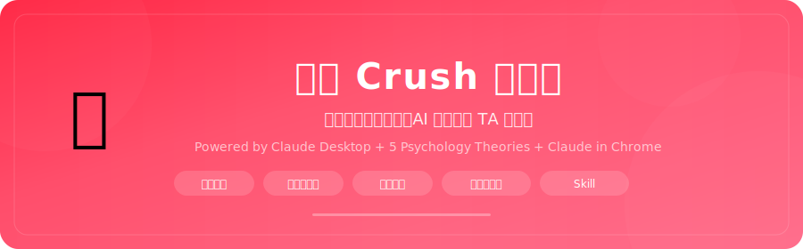
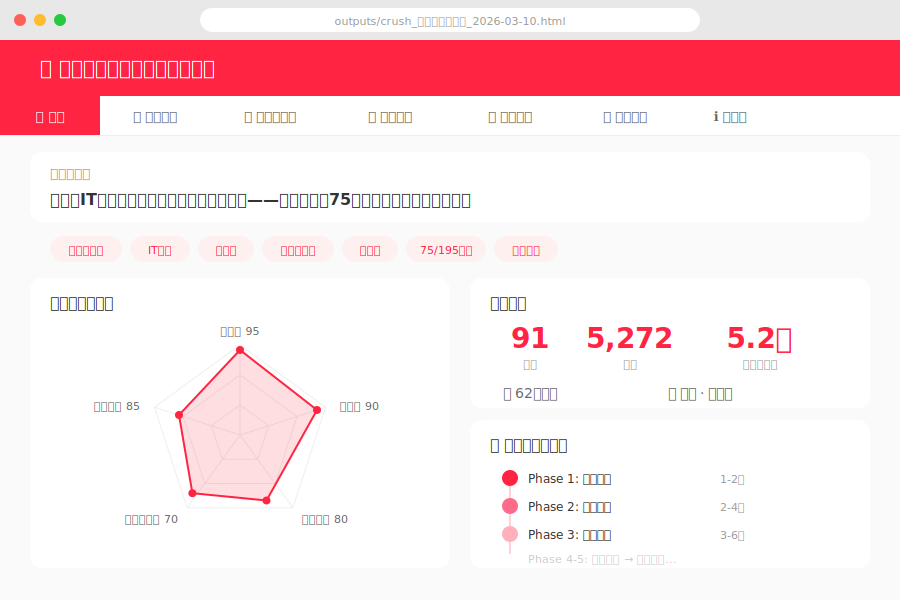

<p align="center">
  
</p>

<p align="center">
  <strong>暗恋一个人，只有 TA 的小红书？交给 AI。</strong>
</p>

<p align="center">
  
  
  
  
</p>

<p align="center">
  <a href="https://lhfer.github.io/xiaohongshu-crush-analyzer/">👉 点击体验 Live Demo（真实报告效果）👈</a>
</p>

<p align="center">
  <a href="#-30-秒看懂它能干嘛">看懂它</a>&nbsp;&nbsp;·&nbsp;&nbsp;
  <a href="https://lhfer.github.io/xiaohongshu-crush-analyzer/">Live Demo</a>&nbsp;&nbsp;·&nbsp;&nbsp;
  <a href="#-安装只需-1-分钟">安装</a>&nbsp;&nbsp;·&nbsp;&nbsp;
  <a href="#-使用方法">使用</a>&nbsp;&nbsp;·&nbsp;&nbsp;
  <a href="#-faq">FAQ</a>
</p>

---

## 🤔 30 秒看懂它能干嘛

你心里有个人，只有 TA 的小红书主页链接。

粘贴给 Claude，接下来它会：

1. **自动翻完 TA 的所有笔记和收藏** — 一条不漏，连 TA 偷偷收藏了什么都知道
2. **用 5 套心理学理论给 TA 画像** — 比 TA 自己都更了解 TA
3. **推断 TA 会喜欢什么样的人** — 收藏夹暴露了 TA 嘴上不说的偏好
4. **生成一套分阶段追求攻略** — 从第一条评论怎么写，到什么时候表白，有话术、有节奏、有分支应对

最终你会得到一份 **7 个 Tab 的交互式 HTML 报告**，打开就能用。

> **不想搞对象？** 纯画像模式同样好用 — 分析博主、了解合作方、研究竞品账号，随你。

---

## 🖼 效果预览

### 先看报告长什么样

<p align="center">
  <a href="https://lhfer.github.io/xiaohongshu-crush-analyzer/">
    
  </a>
</p>

<p align="center">
  <a href="https://lhfer.github.io/xiaohongshu-crush-analyzer/">
    
  </a>
</p>

> 上面是一份真实分析报告的 Demo（已脱敏）。7 个 Tab 全部可交互 — 雷达图、匹配度自测、笔记搜索筛选全能点。

### 报告里有什么？

| Tab | 你能看到什么 | 亮点 |
|-----|-------------|------|
| **📊 总览** | 一句话概括 TA + 五维雷达图 + 核心标签 | 30 秒了解一个人 |
| **🔍 深度画像** | 9 维度逐一分析 + Big Five 人格 + 置信度 | 每条推断都有证据链 |
| **💜 理想型画像** | TA 会被什么人吸引？6 维推断 + 匹配度自测 | **你能给自己打分，看和 TA 多配** |
| **📋 笔记一览** | 全部笔记列表，可搜索、可按分类筛选 | 快速找到话题切入点 |
| **🎯 追求策略** | 5 阶段路线图 + 每步的分支应对 | **TA 回了怎么办、不回怎么办都有** |
| **💬 话术锦囊** | 评论话术 + 私信开场白 + 转微信话术 | 基于 TA 真实内容量身定制 |
| **ℹ️ 方法论** | 数据来源 + 分析逻辑 + 局限性声明 | 知其然也知其所以然 |

### 两个最核心的 Tab

<table>
<tr>
<td width="50%">

**💜 理想型画像 — TA 到底喜欢什么样的人？**

基于 5 大心理学理论 + 收藏夹行为分析，从 6 个维度推断 TA 的理想型。每个维度都有证据链。

还有 **交互式匹配度自测** — 拖动滑块给自己打分，实时计算你和 TA 的匹配度百分比。

</td>
<td width="50%">

**🎯 追求策略 — 不是鸡汤，是作战地图**

5 个阶段从 "刷存在感" 到 "关系升温"，每个阶段：
- 具体该做什么（选哪条笔记评论、说什么）
- 对方可能的 3 种反应
- 每种反应的应对方案

话术全部基于 TA 的真实笔记内容定制。

</td>
</tr>
</table>

---

## ⚡ 安装只需 1 分钟

### 你需要准备

- [Claude Desktop](https://claude.ai/download)（Cowork 模式）
- [Claude in Chrome](https://chromewebstore.google.com/detail/claude-in-chrome/) 浏览器扩展
- 浏览器里 **登录了小红书**（不登录只能看 10 条笔记，登录后能看全部）

### 安装 Skill

把 `SKILL.md` 和 `references/` 放到 Claude Desktop 的 Skills 目录：

```
~/.claude/skills/xiaohongshu-analyzer/
├── SKILL.md
└── references/
    └── analysis-framework.md
```

搞定。

---

## 🚀 使用方法

在 Claude Desktop 对话框里直接说：

```
帮我分析这个小红书 https://www.xiaohongshu.com/user/profile/xxxxx
```

或者更直接：

```
我想追这个人，分析一下 TA 的小红书：[链接]
```

AI 会自动开始浏览、采集、分析，最后把报告存到 `outputs/` 文件夹。

### 纯画像模式（不搞对象也能用）

```
纯画像分析：https://www.xiaohongshu.com/user/profile/xxxxx
```

---

## 🧠 它凭什么分析得准？

不是玄学，是有论文的。

### 心理学理论框架

| 理论 | 用来干嘛 |
|------|----------|
| **Byrne 相似-吸引范式** (1971) | 人被态度、价值观相似的人吸引 — 用来匹配兴趣 |
| **Watson Big Five 匹配** (2004) | 尽责性和宜人性的匹配度影响最大 — 用来做人格配对 |
| **Aron 自我扩展模型** (1986) | 人被能带来新体验的人吸引 — 收藏夹里全是线索 |
| **Bowlby 依恋理论** | 安全型依恋最受欢迎 — 用来推断 TA 需要什么情感模式 |
| **Dweck 成长型思维** (2006) | 展现成长比展现完美更有吸引力 — 用来指导人设策略 |

### 核心洞察：收藏夹 > 笔记

发布的内容是 TA 想给别人看的「前台表演」。<br/>
收藏的内容是 TA 给自己看的「真实偏好」。

**收藏了但没发过的内容 = TA 的秘密兴趣 = 你的破冰利器。**

---

## 📁 项目结构

```
xiaohongshu-crush-analyzer/
├── SKILL.md                       # 核心 Skill 文件（AI 读这个）
├── references/
│   └── analysis-framework.md      # 9 维分析框架 + 心理学理论详解
├── examples/
│   └── sample-report-structure.md # 报告 7 个 Tab 的结构说明
├── docs/
│   └── index.html                 # Live Demo（真实报告，已脱敏）
├── assets/                        # 图片资源
├── LICENSE
└── README.md                      # 你在看的这个
```

---

## ❓ FAQ

<details>
<summary><strong>一次分析大概要多久？</strong></summary>

取决于笔记数量：
- 30 条以下：5-8 分钟
- 30-100 条：8-15 分钟
- 100+ 条：15-25 分钟
</details>

<details>
<summary><strong>不登录小红书能用吗？</strong></summary>

能用，但效果大打折扣。未登录只能看到约 10 条笔记，看不了详情和收藏。<br/>
登录后数据量是未登录的 <strong>5-10 倍</strong>，分析质量天差地别。
</details>

<details>
<summary><strong>收藏夹设了私密怎么办？</strong></summary>

自动跳过，报告中标注「收藏夹不可见」。分析照样能做，只是失去了最有价值的数据源，理想型推断的准确度会降低。
</details>

<details>
<summary><strong>Chrome 扩展总断连？</strong></summary>

正常现象。自动滚动脚本跑 30-60 秒时扩展可能超时，Skill 内置了自动重连逻辑，不用手动处理。
</details>

<details>
<summary><strong>分析结果能信多少？</strong></summary>

每个维度都标注了置信度（高/中/低）。基础信息（城市、职业）通常比较准，心理人格和理想型推断是「有理论支撑的合理猜测」，不是确定性结论。

<strong>把它当军师建议，别当圣旨。</strong>
</details>

<details>
<summary><strong>这样分析别人 OK 吗？</strong></summary>

所有分析仅基于<strong>公开可见信息</strong>。策略建议的核心是「做更好的自己去吸引对方」，不是操纵术。<br/>
报告末尾永远有一句话：<strong>最好的策略是做真实的自己。</strong>
</details>

---

## 🤝 贡献

欢迎 PR，这些方向特别需要：

- 支持更多平台（抖音、微博、Instagram）
- 增加心理学理论框架
- 改进报告可视化模板
- 多语言支持

---

## ⚖️ 免责声明

本工具仅供学习和个人使用。分析基于公开社交媒体内容，结合心理学研究生成，不等同于专业心理评估。请尊重他人隐私，理性使用。

---

<p align="center">
  <sub>Built with Claude Desktop · Powered by psychology, not pickup artistry.</sub>
</p>
